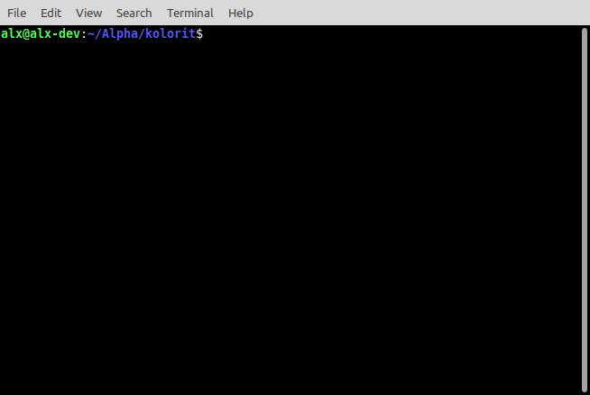

#DEPRECEATED

** Kolorit**



Still in early development stage, meaning windows support should come in near future.
For now, windows 10 users should be able to use it with `win32console` gem, but it's not tested yet.

Kolorit allow you to easily colorize any string, integer, array, hash, without touching core classes.
Use methods `#colorize` and `#kolorize` for power of Ruby blocks.

# How to install

GitHub repo is always updated before rubygems.
```bash
git clone https://www.github.com/alx3dev/kolorit.git
cd kolorit
bundle install
```

Install from rubygems:
```bash
gem install kolorit
```

# How to use:

 - require `kolorit` gem in your file

```ruby
# you can call method on string only if you include module outside of main namespace.
# that's what happen when you require kolorit

require 'kolorit'
'this is red string'.red

```

 - Inlcude kolorit module to be used where you need it

```ruby
# if you include it inside another class/module, call methods with arguments

require 'kolorit/linux' # or 'kolorit/windows'

include Kolorit::Linux # or ::Windows

blue 'some string'
red 'red bold string'
```

`#colorize` accept color as first argument, and string as second  
`#kolorize` accept string as first argument and color as second

Both of this methods also accept block - `#colorize` block should return `:color`,
while `#kolorize` block should return `'string'` to be colorized.

You can allow methods to automatically `#puts` or `#print` colorized string:

```ruby
# this call without arguments is same as with :puts
Kolorit.output :puts
# or
Kolorit.output :print

# everything else is same as false
Kolorit.output false
```

Enable or disable colorization globally:

```ruby
Kolorit.disable
# or
Kolorit.enable
```

 > Examples are better then documentation, so until I write docs...

**[example 1]**
```ruby
colorize(:green) do
  if RUBY_VERSION.start_with?('3')
    'Happy Coding!'.bold
  else
    'You should try Ruby 3, it is much better!'
  end
end
```

**[example 2]**
```ruby
def color_line(param)

  # check if kolorit is enabled (default: true)
  status = Kolorit.enabled?

  # enable kolorit if disabled
  Kolorit.enable

  # colorize param based on it's class
  colorize(:cyan) do
    case param.class.name
    when 'String'
      :green
    when 'Integer'
      :yellow
    else
      :gray
    end
  end

  # keep module status same as before method action
  Kolorit.disable unless status
end
```

**[example 3]**
```ruby
# enable automated #puts or #print
Kolorit.output :puts

# define message to print
message = 'Thank you Matz, for Amazing Ruby '

# print bold cyan message based on block evaluation
colorize(:bold) { RUBY_VERSION[0] == '3' ? message + '3' : message + 'language'}.cyan

# disable output
Kolorit.output false
```
